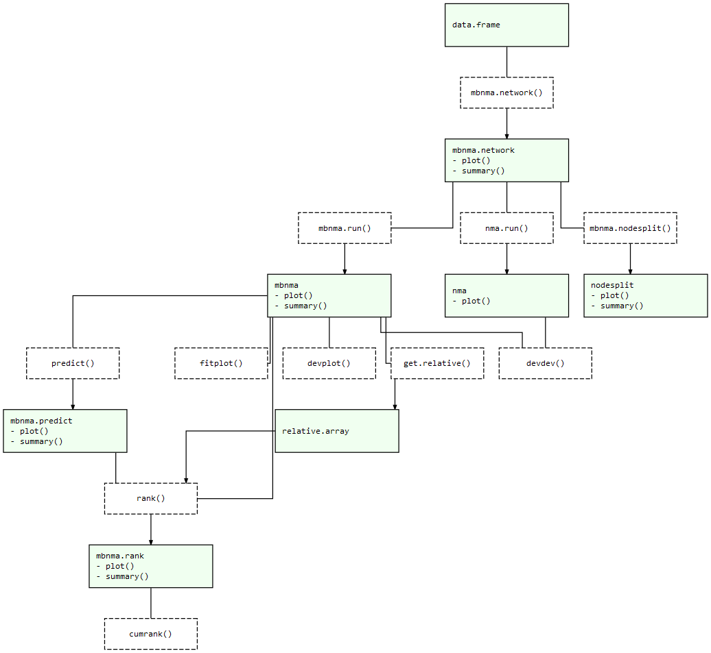

<!-- README.md is generated from README.Rmd. Please edit that file -->
<!-- badges: start -->

[](https://CRAN.R-project.org/package=MBNMAdose)
[](https://github.com/hugaped/MBNMAdose/actions)
[](https://zenodo.org/badge/latestdoi/195961874)
[](https://github.com/hugaped/MBNMAdose/actions/workflows/R-CMD-check.yaml)
<!-- badges: end -->

# MBNMAdose 0.4.1

The goal of `MBNMAdose` is to provide a collection of useful commands
that allow users to run dose-response Model-Based Network Meta-Analyses
(MBNMA). This allows evidence synthesis of studies that compare multiple
doses of different agents in a way that can account for the
dose-response relationship.

Whilst making use of all the available evidence in a statistically
robust and biologically plausible framework, this also can help connect
networks at the agent level that may otherwise be disconnected at the
dose/treatment level, and help improve precision of estimates(Pedder et
al. 2021). It avoids “lumping” of doses that is often done in standard
Network Meta-Analysis (NMA). All models and analyses are implemented in
a Bayesian framework, following an extension of the standard NMA
methodology presented by (Lu and Ades 2004) and are run in JAGS (Just
Another Gibbs Sampler). For full details of dose-response MBNMA
methodology see Mawdsley et al. (2016). Throughout this package we refer
to a **treatment** as a specific **dose** or a specific **agent**.

A short introductory YouTube video from the ESMAR Conference 2021 can be
found [here](https://doi.org/10.6084/m9.figshare.13637936.v1)

## Installation

On CRAN you can easily install the current release version of
`MBNMAdose` from [CRAN](https://CRAN.R-project.org) with:

``` r
install.packages("MBNMAdose")
```

For the development version the package can be installed directly from
GitHub using the `devtools` R package:

``` r
# First install devtools
install.packages("devtools")

# Then install MBNMAdose directly from GitHub
devtools::install_github("hugaped/MBNMAdose")
```

## Workflow

Functions within `MBNMAdose` follow a clear pattern of use:

1.  Load your data into the correct format using `mbnma.network()` and
    explore potential relationships
2.  Perform a dose-response MBNMA using `mbnma.run()`. Modelling of
    effect modifying covariates is also possibly using Network
    Meta-Regression.
3.  Test for consistency at the treatment-level using functions like
    `nma.nodesplit()` and `nma.run()`
4.  Examine model outputs, such as relative effects, forest plots and
    treatment rankings
5.  Use your model to predict responses using `predict()`

At each of these stages there are a number of informative plots that can
be generated to help understand the data and to make decisions regarding
model fitting. Exported functions in the package are connected like so:

*MBNMAdose package structure: Light green nodes represent classes and
the generic functions that can be applied to them. Dashed boxes indicate
functions that can be applied to objects of specific classes*


## References

<div id="refs" class="references csl-bib-body hanging-indent"
entry-spacing="0">

<div id="ref-lu2004" class="csl-entry">

Lu, G., and A. E. Ades. 2004. “Combination of Direct and Indirect
Evidence in Mixed Treatment Comparisons.” Journal Article. *Stat Med* 23
(20): 3105–24. <https://doi.org/10.1002/sim.1875>.

</div>

<div id="ref-mawdsley2016" class="csl-entry">

Mawdsley, D., M. Bennetts, S. Dias, M. Boucher, and N. J. Welton. 2016.
“Model-Based Network Meta-Analysis: A Framework for Evidence Synthesis
of Clinical Trial Data.” Journal Article. *CPT Pharmacometrics Syst
Pharmacol* 5 (8): 393–401. <https://doi.org/10.1002/psp4.12091>.

</div>

<div id="ref-pedder2021" class="csl-entry">

Pedder, H., S. Dias, M. Bennetts, M. Boucher, and N. J. Welton. 2021.
“Joining the Dots: Linking Disconnected Networks of Evidence Using
Dose-Response Model-Based Network Meta-Analysis.” Journal Article.
*Medical Decision Making* 41 (2): 194–208.

</div>

</div>
